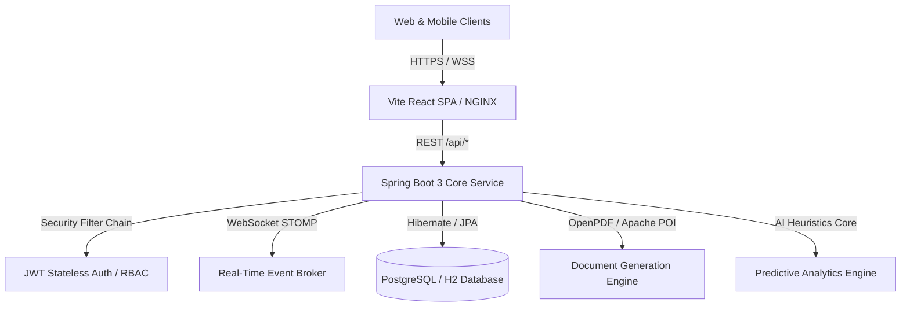
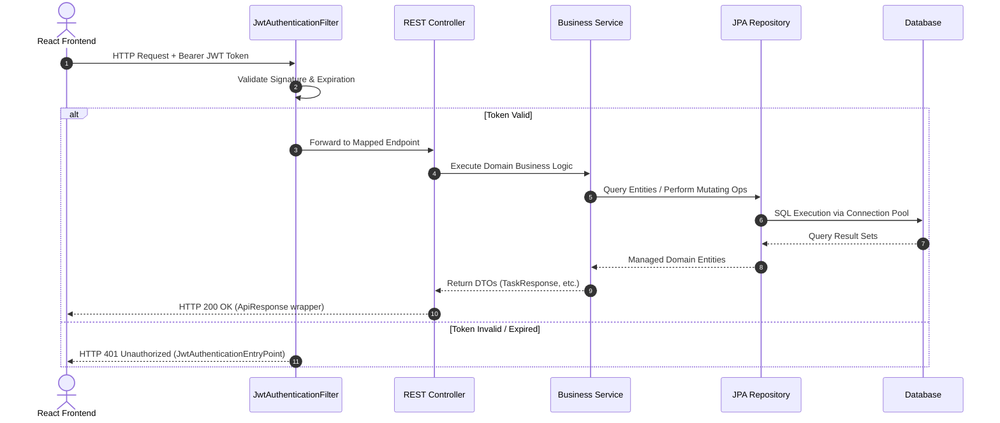

# TaskFlow Enterprise — System Architecture Blueprint

This document defines the high-level system architecture, component boundaries, domain interactions, and data flows for the TaskFlow Enterprise Project Management System.

---

## 1. System Topology Overview

TaskFlow Enterprise utilizes a decoupled modern multi-tier architecture consisting of a single-page application (SPA) frontend, an enterprise Spring Boot REST & WebSocket core, and an enterprise persistence layer.

---

## 2. Technology Stack & Framework Selection

### 2.1 Backend Architecture
- **Language & Runtime:** Java 21 LTS (Modern Switch Expressions, Virtual Threads ready, Pattern Matching)
- **Application Framework:** Spring Boot 3.x
- **Persistence:** Spring Data JPA with Hibernate ORM
- **Security:** Spring Security 6 with stateless JWT Bearer token authentication & PBKDF2 / BCrypt password hashing
- **Messaging:** Spring WebSocket with SockJS and STOMP sub-protocol for microsecond sprint updates
- **Document Generation:** OpenPDF (PDF executive briefings) & Apache POI (Excel spreadsheets)
- **API Documentation:** SpringDoc OpenAPI v3 / Swagger UI

### 2.2 Frontend Architecture
- **Library:** React 18 (Concurrent Mode, Hooks, Functional Components)
- **Build Tool:** Vite 5 with Hot Module Replacement (HMR)
- **Routing:** React Router v6 with declarative nested layout routing and authenticated route guards
- **Iconography:** Lucide React
- **Styling:** Modular CSS Design System with CSS Custom Properties, hardware-accelerated transforms, and glassmorphism tokens

---

## 3. Data Flow & Security Pipeline

---

## 4. Key Subsystems

### 4.1 Real-Time Collaborative Sync
- Task status changes trigger WebSocket notifications broadcast over topic destinations (e.g. `/topic/tasks`, `/topic/projects/{id}`).
- Connected clients update their local Kanban sprint state immediately without requiring manual page reloads.

### 4.2 Document Export Pipeline
- Executive reports dynamically stream binary content directly to the HTTP response output stream, preventing high memory overhead on large tenant datasets.
- Includes audit trails detailing exporting user, timestamp, and query parameters.
